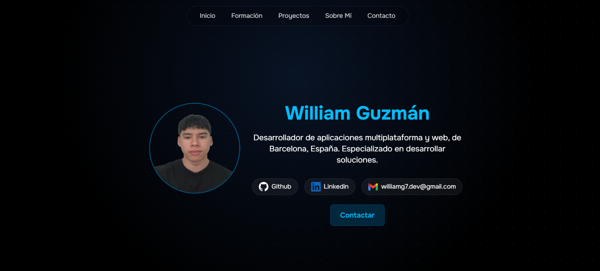

# Portfolio - William Guzmán

Portfolio personal desarrollado con **Astro** y **Tailwind CSS**, diseñado para mostrar mi formación, proyectos y habilidades como desarrollador de aplicaciones multiplataforma y web.

## Características

- 🎨 **Diseño moderno y minimalista** con gradientes personalizados
- 📱 **Totalmente responsivo** - optimizado para móvil, tablet y desktop
- ⚡ **Rendimiento óptimo** con Astro (SSG)
- 🎯 **Navegación fluida** con scroll suave entre secciones
- 🌙 **Fondo degradado dinámico** con efectos visuales atractivos
- 🔗 **Integración con redes sociales** (GitHub, LinkedIn, Gmail)

## Tecnologías Utilizadas

- **[Astro](https://astro.build/)** - Framework web moderno para sitios rápidos
- **[Tailwind CSS](https://tailwindcss.com/)** - Framework CSS utility-first
- **[TypeScript](https://www.typescriptlang.org/)** - Tipado estático para JavaScript
- **[Onest Variable Font](https://fonts.google.com/specimen/Onest)** - Tipografía personalizada

## Instalación y Uso

### Requisitos previos

- Node.js 18.14.1 o superior
- pnpm (recomendado) o npm

### Comandos disponibles

| Comando           | Acción                                              |
| :---------------- | :-------------------------------------------------- |
| `pnpm install`    | Instala las dependencias                            |
| `pnpm dev`        | Inicia el servidor de desarrollo en `localhost:4321`|
| `pnpm build`      | Compila el proyecto para producción en `./dist/`    |
| `pnpm preview`    | Previsualiza la build de producción localmente      |

## Recursos de Diseño

Este proyecto utiliza los siguientes recursos externos para diseño y componentes:

- **[ibelick Backgrounds](https://bg.ibelick.com/)** - Generador de fondos con gradientes CSS
- **[Tabler Icons](https://tabler.io/icons)** - Biblioteca de iconos SVG de código abierto
- **[Flowbite](https://flowbite.com/)** - Componentes UI con Tailwind CSS
- **[SVGL](https://svgl.app/)** - Colección de logos SVG de tecnologías
- **[Shots.so](https://shots.so/)** - Generador de mockups y capturas de pantalla

## Secciones del Portfolio

### Inicio
Presentación personal con foto de perfil, descripción profesional y enlaces a redes sociales.

### Formación
Timeline con mi formación académica y cursos relevantes:
- CFGS Desarrollo de Aplicaciones Multiplataforma (2024 - Actualidad)
- Lógica y Fundamentos de Programación - Platzi (2023)
- Aplicación de Electrónica y Robótica - SENA (2021)

### Proyectos
Galería de proyectos destacados con descripción, tecnologías utilizadas e imágenes.

### Sobre Mí
Información personal, enfoque profesional y objetivos como desarrollador.

## Responsividad

El portfolio está optimizado para todas las pantallas:

- **Móvil** (< 768px): Layout vertical, elementos apilados
- **Tablet** (768px - 1024px): Diseño híbrido con elementos horizontales
- **Desktop** (> 1024px): Diseño completo con anchura máxima de 1120px

## Contribuciones

Este es un proyecto personal, pero si encuentras algún bug o tienes sugerencias, siéntete libre de abrir un issue o pull request.

## Contacto

- **GitHub**: [@williamG7](https://github.com/williamG7)
- **LinkedIn**: [William Guzmán](https://www.linkedin.com/in/williamg7dev/)
- **Email**: williamg7.dev@gmail.com

## Licencia

© 2025 William Guzmán. Todos los derechos reservados.

---

**Desarrollado con ❤️ por William Guzmán**
